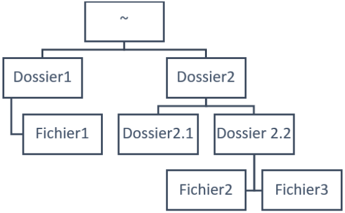

# Exercice 2. Prise en main de l’interpréteur de commandes

## Manuel
1.  La commande `which` permet de retourner le chemin vers le fichier de la commande.
2. Pour trouver un terme sur le manuel il suffit de faire `/texte`.
3. Pour sortir du manuel il suffit de presser la touche `Q`
4. `man 6 which` La commande n'existe pas avec ses paramètres.

## Navigation dans l’arborescence des fichiers
1. Pour aller dans le dossier `/var/log` il faut faire `cd /var/log`.
2. Pour remonter dans le dossier parent avec le chemin relatif il faut faire `cd ..`.
3. Pour retournez dans le dossier personnel il faut faire `cd ~`.
4. Pour retourner dans le dossier précèdent il faut faire `cd -`.
5. Le message permission denied apparait.
6. Le serveur nous renvoi que le paramètre `cd` a la commande `sudo` n'existe pas car il ne trouve pas cd dans le PATH. 
7. Pour créer cette arborescence : 

`mkdir dossier1`
`cd dossier1`
`nano fichier1.txt`
`cd ..`
`mkdir dossier2`
`cd dossier2`
`mkdir dossier2.1`
`mkdir dossier2.2`
`cd dossier 2.2`
`nano fichier2.txt`
`nano fichier3.txt`
8. Pour revenir dans le dossier personnel il faut faire `cd /` puis `rm /dossier1/fichier1.txt` va supprimer le fichier 1. La commande `rm dossier1` renvoie qu'il est impossible de supprimer `dossier1` car il s'agit d'un dossier.
9. La commande qui permet de supprimer un dossier est `rmdir`.
10. Une erreur nous est renvoyé disant que le dossier n'est pas vide. 
11. Pour supprimer un dossier et son contenu il faut utiliser la commande `rm -r`.

## Commandes importantes
1. La commande pour afficher l'heure est `date`. La commande `time` permet de voir le temps depuis le qu'elle l'utilisateur utilise le CPU avec sa commande.
2. Les fichiers contenant des points sont des fichiers cachés.
3. La commande `ls` se situ dans `/usr/bin/ls`.
4. Il n'existe pas d'entré de manuel pour la commande `ll`. La commande `ll` est un raccourci de la commande `ls _alF`.
5. La commande qui permet d'afficher le contenu du dossier bin est `/bin`.
6. La commande `ls ..` permet de renvoyer la liste des dossiers et fichier du dossier parents.
7. La commande qui donne le chemin complet du dossier courant est `pwd`.
8. La commande `echo 'bip' > plop` va la première fois créer un fichier `plop` et écrire dedans `bip`. La seconde exécution va écraser le contenu du fichier `plop` car il existe déjà et le remplacer par `bip`.
9. La commande `echo 'bip' >> plop` va la première fois créer un fichier `plop` et écrire dedans `bip`. La seconde exécution va écrire a la suite du fichier `plop` de nouveau bip.
10. La commande `sleep 10 | echo 'toto'` va écrire toto puis attendre 10s.
11. La commande `file` renvoi l'extension du fichier.
12. `echo 'Hello Toto !' > original`. Le changement du fichier `original` entraine les même changement sur le fichier `lien_phy`. La suppression du fichier `original` n'engendre aucune conséquence sur le fichier `lien_phy`.
13. Un lien symbolique va faire que peux importe le fichier modifier les 2 entraineront une modification sur l'autre. Si le fichier `lien_phy` est supprimé le fichier `lien_sym` l'es également.
14. Le raccourci clavier pour arrêter le défilement est `CTRL + S` et pour le relancer est `CTRL + Q`.
15. Pour afficher les 5 première ligne du fichier `/var/log/syslog` il suffit de faire `head -4 /var/log/syslog`. Pour affiches les 15 dernière ligne il suffit de faire `tail -15 /var/log/syslog`. Pour afficher de la ligne 10 à 20 il faut faire `sed -n 10,20p /var/log/syslog`.
16. La commande `dmesg | less` me renvoi que je n'ai pas la permission de faire la commande `dmesg`
17. Le fichier `/etc/passwd` contient toute les informations relativent aux utilisateurs. Pour afficher la page du manuel il suffit de faire `man passwd`.
18. La commande qui permet d'afficher la première colonne triée par ordre alphabétique inverse du fichier `/etc/passwd` est `cut -d: -f1 /etc/passwd | sort -r`.
19. La commande qui permet de connaitre le nombre d'utilisateurs ayant un compte est `cut -d: -f1 /etc/passwd | sort -r | wc -w`.
20. 
21. Pour trouver tous les fichiers se nommant `passwd` il faut faire `find / -name 'passwd'`.
22. Pour que la liste des fichiers soit renvoyé dans un fichier il faut faire la commande `find / -name 'passwd' > ~/list_passwd_files.txt 2> /dev/null`
23. 
24. Le fichier `history.log` est dans `/var/log/apt/history.log`.
25. Le fichier apparait. (Je ne comprend donc pas le pourquoi).

# Exercice 3. Découverte de l’éditeur de texte nano
1. `cat /var/log/syslog > ~/log.txt`
2. `CTRL + 6`
3. `CTRL K` puis `CTRL U`
4. `ALT + U`
5. `CTRL + X`

# Exercice 4. Personnalisation du shell
1. `cat ~/.bashrc > ~/.bashrc_bak`
2. `nano .bashrc`
3. 
4. `PS1='${debian_chroot:+($debian_chroot)}\[\033[01;035m\][\A]\[\033[00m\] - \[\033[01;32m\]\u@\h\[\033[00m\]:\[\033[01;36m\]\w\[\033[00m\]$`
